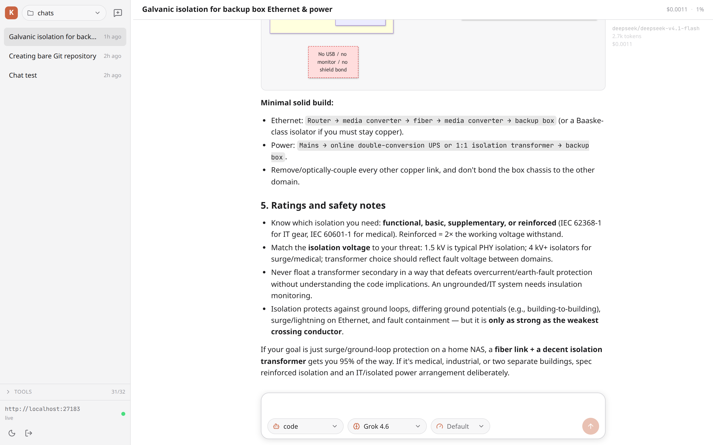
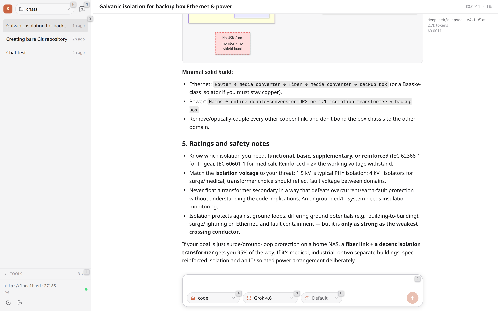
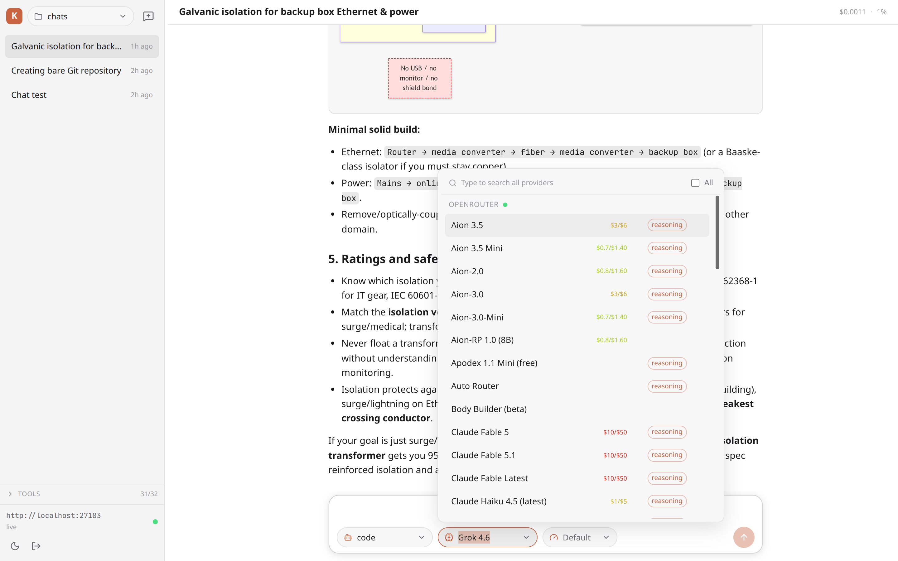

# Kilo Web Chat

A ChatGPT / claude.ai-style web chat interface for **Kilo Code** and **opencode v1**
servers, built with **Vue 3**, **Vite**, **TypeScript**, and **Reka UI**.

It talks directly to the server's HTTP API, so it works with any compatible
instance — the Kilo Code fork and upstream opencode v1 both expose the same
instance API (`/session`, `/message`, `/event`, `/config`, `/agent`, `/provider`).

## Features

- **Instance autodetection** — probes local ports for live servers, then lets you
  pick one if several are running. Manual address entry and saved connections included.
- **Product detection** — labels each instance as *Kilo Code*, *opencode*, or generic
  *Server* from the server config.
- **Chat UI** — streaming assistant messages, Markdown + syntax highlighting,
  reasoning blocks, collapsible tool calls, file/image parts, and session history.
- **Mode selector** — the primary agents (`code`, `plan`, `ask`, `debug`,
  `orchestrator`, …) exposed by `/agent`.
- **Model selector** — searchable picker across all providers, connected providers first.
- **Interactive prompts** — permission requests (allow once / always / deny) and
  agent questions (option buttons + free text).
- **Session management** — new chat, rename, delete, live status.
- **Light / dark theme**, responsive sidebar.

## Screenshots

The chat, with streaming Markdown (including Mermaid diagrams), the hover
model/token/cost gutter, and the composer with mode/model/effort selectors:



Hold `Alt` to reveal the keyboard shortcuts on the controls they trigger
(`P` project, `N` new chat, `S` sessions, `T` tools, `A` mode, `M` model,
`E` effort, `C` focus chat):



The model picker (connected providers first, sortable/searchable, priced):



## Getting started

```bash
bun install      # or: npm install
bun run dev      # http://127.0.0.1:4173
```

Then start a server (or use one already running):

```bash
kilo serve --port 4096
# or, without the Kilo wrapper:
opencode serve --port 4096
```

Open the app and it will scan local ports. If a server requires a password
(`KILO_SERVER_PASSWORD`), it is shown as *password required* and you can enter
credentials in **Add address**.

Production build:

```bash
bun run build
bun run preview
```

## Running with PM2

`ecosystem.config.cjs` defines two PM2 apps: `kilo-server` (`kilo serve` on
`127.0.0.1:27183`) and `kilo-chat` (the **Vite dev server** on `127.0.0.1:4173`).

`kilo-chat` runs in dev mode, so it serves `src/` directly and hot-reloads on
every file change — no rebuild needed and the UI is always current. Editing
files under `src/` triggers HMR in the browser. To serve a static production
build instead, run `bun run build` and switch the app's `args` to
`preview --host 127.0.0.1 --port 4173`.

Port `27183` is an uncommon high port chosen to avoid collisions with the VS Code
extension, which starts its own server on a random port (`--port 0`). The UI
autodetects it (see `DEFAULT_PORTS` in `src/api/discovery.ts`). Change the
`--port` in the app's `args` if it is ever taken.

The app sets `KILO_PARENT_PID=0` to disable the server's parent-watchdog. PM2 is
the supervisor here (not an editor client), and if `KILO_PARENT_PID` leaks in from
the shell that launched PM2, the watchdog watches a dead PID and kills the server
about a second after startup, causing a crash-restart loop.

```bash
pm2 start ecosystem.config.cjs
pm2 save                      # persist the process list
pm2 startup                   # optional: relaunch on boot
```

To apply config changes (including changed `args`) to an already-running app:

```bash
pm2 delete kilo-chat && pm2 start ecosystem.config.cjs --only kilo-chat
pm2 save
```

Set `KILO_SERVER_PASSWORD` in the `kilo-server` app's `env` to require auth;
leave it unset for a loopback-only, unauthenticated server.

## Configuration

An optional runtime config lives at `public/kilo-web-chat.json` and is fetched
from the site root (`/kilo-web-chat.json`) on load. It is a plain static file, so
you can edit it on a running deployment and the change applies on the next
reload — no rebuild or restart.

```json
{
  "defaultAgent": "plan"
}
```

`defaultAgent` selects a primary agent on load, overriding the last-used saved
agent, as long as it names an agent the server exposes. A `?agent=` GET param
still takes precedence when present; an absent, empty (`null`), or invalid value
leaves the last-used agent in effect.

## URL parameters

The URL can preselect a chat and prefill the composer:

- `?session=<id>` — open an existing chat.
- `?agent=<name>` — preselect a primary agent (e.g. `plan`), applied when it exists.
- `?query=<text>` — prefill the composer with text.
- `?submit=1` — send the prefilled query immediately, creating a new chat if
  none is open. A bare `?submit` also counts as enabled. After sending, the
  `query`/`agent`/`submit` params are removed so a reload does not resend.

```text
http://localhost:4173/?agent=plan&query=Review%20this%20repo&submit=1
```

## How detection works

`src/api/discovery.ts` probes `http://127.0.0.1:<port>/global/health` and
`/config` across a small set of ports (`4096` first, its neighbours, and a few
common dev ports) on `localhost` (loopback aliases such as `127.0.0.1` are
canonicalized to `localhost`). A response shape of
`{ healthy: true, version }` identifies a server, and the config's `$schema`
(`https://app.kilo.ai/config.json` vs `https://opencode.ai/config.json`) is used
to label the product. Saved origins are re-probed on every scan so you can
connect to non-default ports or remote hosts manually.

## Authentication

The server only requires auth when `KILO_SERVER_PASSWORD` is set (HTTP Basic,
username defaults to `kilo`). Credentials entered in the UI are stored in
`localStorage` alongside the saved connection so the app can reconnect. Use
`kilo serve` without `KILO_SERVER_PASSWORD` for a no-auth local setup.

## CORS / mixed content

The server allows `http://localhost:*` and `http://127.0.0.1:*` origins
automatically, so the Vite dev server can talk to it directly. Any other origin
— including a reverse-proxied host such as `http://chat.localhost` — must be
listed explicitly, or the browser blocks the API calls and discovery reports
"No servers found":

```bash
kilo serve --port 27183 --cors http://chat.localhost --cors http://my-host:8080
```

The `kilo-server` PM2 app in `ecosystem.config.cjs` already passes
`--cors http://chat.localhost`.

Browsers block `http://127.0.0.1` requests from an `https://` page (mixed
content), so serve this UI over `http://` locally.

## Project structure

```
src/
  api/
    client.ts       HTTP + SSE client (auth, query scoping, event stream)
    discovery.ts    Port probing and product detection
    types.ts        API types (sessions, messages, parts, events, …)
  stores/
    connection.ts   Instance list, saved connections, client lifecycle
    server.ts       Config, agents/modes, providers/models, preferences
    sessions.ts     Session list + mutations
    chat.ts         Messages, parts, streaming state, permissions/questions
    live.ts         SSE subscription with reconnect + resync
    app.ts          Wires the stores together into app-level actions
  components/       UI (Reka UI primitives + custom chat components)
```

## API surface used

| Purpose | Endpoint |
| --- | --- |
| Health / product detection | `GET /global/health`, `GET /config`, `GET /path` |
| Modes | `GET /agent` (primary, non-hidden) |
| Models | `GET /provider` (connected first) |
| Sessions | `GET/POST /session`, `PATCH/DELETE /session/{id}` |
| Messages | `GET /session/{id}/message` |
| Send / abort | `POST /session/{id}/prompt_async`, `POST /session/{id}/abort` |
| Streaming | `GET /event?directory=…` (SSE) |
| Permissions | `GET /permission`, `POST /permission/{id}/reply` |
| Questions | `GET /question`, `POST /question/{id}/reply` |

Instance-scoped requests pass `?directory=<worktree>` so the server routes them
to the right project.

## Notes and limitations

- Model **variants** are passed through when present but there is no dedicated
  variant picker yet.
- Attachments: file/image parts are rendered; the composer currently sends text
  only.
- Streaming relies on `message.part.updated` (full parts) and ignores fine-grained
  `message.part.delta` frames, so it works with both the plain and `.1`/`sync`
  event generations.
- Commands (`/command`) are fetched but not yet surfaced in an autocomplete menu.